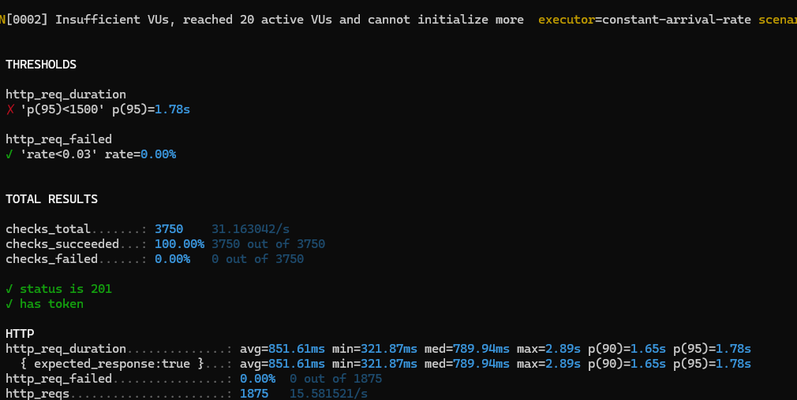
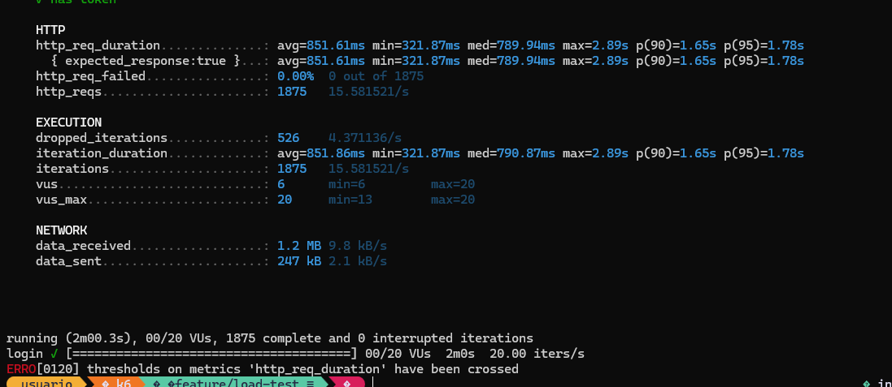

# Load Test: FakeStoreAPI Login - Ejercicio K6

## Descripción del Ejercicio
Prueba de carga para el endpoint POST `/auth/login` de fakestoreapi.com utilizando **k6** como herramienta de testing.

### Requerimientos Cumplidos
- ✅ **Data parameterization** desde archivo CSV (`data/users.csv`)
- ✅ **Throughput**: 20 TPS (transacciones por segundo)
- ✅ **SLA Latencia**: p95 < 1.5 segundos
- ✅ **SLA Errores**: Tasa de error < 3%
- ✅ **Validaciones**: HTTP 201 + Token JWT presente

## Herramienta Utilizada
- **k6** v0.47.0+ - Motor de pruebas de carga moderno y eficiente

## Arquitectura del Proyecto
```
k6/
├── main.js                 # Entry point
├── config/
│   └── test.json          # Configuración de escenario (20 TPS, 2min)
├── scenarios/
│   └── login.js           # Orquestador (carga CSV, round-robin)
├── scripts/
│   └── login.js           # Implementación HTTP (POST + checks)
├── data/
│   └── users.csv          # 5 credenciales de fakestoreapi.com
└── common/
    └── utils.js           # Utilidades reutilizables
```

## Versiones de Tecnologías

| Tecnología | Versión Requerida | Descripción |
|------------|-------------------|-------------|
| **k6** | v0.47.0+ | Motor de pruebas de carga |
| **Node.js** | v18.0+ | Recomendado (para herramientas adicionales) |
| **curl** | 7.0+ | Para verificaciones manuales |

## Verificación de Versiones

### Verificar k6
```bash
k6 version
```
**Salida esperada:**
```
k6 v0.47.0 (or newer)
```

**Instalación (si no tienes k6):**
- **Windows (Chocolatey)**: `choco install k6`
- **Windows (MSI)**: Descargar desde https://dl.k6.io/msi/k6-latest-amd64.msi
- **Linux**: `sudo apt-get install k6`
- **Mac**: `brew install k6`

---

## Instrucciones Paso a Paso

### Paso 1: Clonar o Navegar al Proyecto

```bash
cd C:\k6
```

Verificar estructura:
```bash
dir
```

**Archivos esperados:**
```
main.js
config/
  └── test.json
scenarios/
  └── login.js
scripts/
  └── login.js
data/
  └── users.csv
common/
  └── utils.js
```

---

### Paso 2: Verificar Archivo de Datos

Comprobar que `data/users.csv` existe y tiene formato correcto:

```bash
type data\users.csv
```

**Contenido esperado:**
```csv
user,passwd
donero,ewedon
kevinryan,kev02937@
johnd,m38rmF$
derek,jklg*_56
mor_2314,83r5^_
```

> **Nota**: El archivo debe tener exactamente 5 usuarios (más header). Cada usuario se usará en round-robin.

---

### Paso 3: Verificar Sintaxis (Smoke Test)

Ejecutar validación rápida sin enviar peticiones reales:

```bash
k6 run --vus 1 --iterations 1 main.js
```

**Salida esperada:**
```
INFO[0000] Login load test - execute with: k6 run main.js
...
✓ status is 201
✓ has token
```

**Errores comunes:**
- `The system cannot find the path specified` → Verificar ruta del CSV
- `SyntaxError` → Revisar comillas en archivos .js

---

### Paso 4: Ejecutar Test Completo

Ejecutar la prueba de carga completa (2 minutos, 20 TPS):

```bash
k6 run main.js
```

**Comportamiento esperado:**
- Inicio: 0-5 segundos (ramp-up)
- Ejecución: 2 minutos a 20 TPS
- Total: ~2,400 iteraciones
- Finalización: Resumen de métricas

**Interrupción (si es necesario):**
```bash
Ctrl+C
```

---

### Paso 5: Ejecutar con Exportación de Resultados

Para guardar métricas en formato JSON:

```bash
k6 run --summary-export=resultados.json main.js
```

**Archivo generado:** `resultados.json` con todas las métricas detalladas.

---

### Paso 6: Ejecutar con CSV Output

Para exportar métricas en tiempo real a CSV:

```bash
k6 run --out csv=metricas.csv main.js
```

**Archivo generado:** `metricas.csv` con datos de cada petición.

---

### Paso 7: Verificar Thresholds

Al finalizar, verificar que aparezca:

```
█ THRESHOLDS
http_req_duration ✓ 'p(95)<1500'
http_req_failed ✓ 'rate<0.03'
```

**Si los thresholds fallan:**
- `✗` en lugar de `✓`
- Revisar métricas para identificar problema

---

### Paso 8: Captura de Pantalla (Para Repositorio)

Tomar una captura de pantalla de la terminal mostrando:
1. El comando de ejecución: `k6 run main.js`
2. El resumen final con thresholds (`█ THRESHOLDS`)
3. Las métricas principales (`█ TOTAL RESULTS`)
4. El estado de los checks (`✓ status is 201`, `✓ has token`)

**Guardar como:** `evidencia-ejecucion.png` o similar

**Ejemplo de salida esperado:**
```
█ THRESHOLDS
http_req_duration ✓ 'p(95)<1500'
http_req_failed ✓ 'rate<0.03'

█ TOTAL RESULTS
checks_total.......: 4788 39.804407/s
checks_succeeded...: 100.00% 4788 out of 4788
checks_failed......: 0.00% 0 out of 4788
✓ status is 201
✓ has token

HTTP
http_req_duration: avg=343.92ms min=324.76ms med=341.26ms max=747.38ms p(90)=353.76ms p(95)=358.88ms
http_req_failed: 0.00% 0 out of 2394
```

> **Nota**: El servicio fakestoreapi.com es gratuito y puede variar en rendimiento. Si los thresholds fallan (latencia > 1.5s), esto es válido — el test está detectando que el servicio no cumple el SLA a 20 TPS.


---

## Ejecución con Variables de Entorno

### Cambiar duración
```bash
set DURATION=5m && k6 run main.js
```

### Cambiar TPS
Modificar `config/test.json`:
```json
"rate": 30,  // Cambiar de 20 a 30 TPS
```

### Ejecutar escenario específico
```bash
k6 run --env SCENARIO=login main.js
```

---

## Troubleshooting

### Error: "The system cannot find the path specified"
**Causa**: Ruta incorrecta al CSV en `scenarios/login.js`

**Solución**:
Verificar que la línea sea:
```javascript
const csvData = open('../data/users.csv');
```

### Error: "reference to undefined identifier 'scenario'"
**Causa**: Versión de k6 antigua

**Solución**: Actualizar a k6 v0.47.0+
```bash
choco upgrade k6  # Windows
```

### Error: "context deadline exceeded"
**Causa**: Timeout de conexión

**Solución**: Verificar conectividad:
```bash
curl -X POST https://fakestoreapi.com/auth/login \
  -H "Content-Type: application/json" \
  -d '{"username":"johnd","password":"m38rmF$"}'
```

---

## Comandos Útiles

### Ver configuración actual
```bash
k6 run --dry-run main.js  # No ejecuta, solo valida
```

### Ejecutar con más VUs
```bash
k6 run --vus 10 main.js  # Ignora config, usa 10 VUs
```

### Ejecutar con duración personalizada
```bash
k6 run --duration 30s main.js  # 30 segundos
```

### Ejecutar en modo "quiet"
```bash
k6 run --quiet main.js  # Solo resultados finales
```

---

## Estructura de Resultados

Después de ejecutar, se generan:

```
k6/
├── main.js
├── resultados.json          # (si usaste --summary-export)
├── metricas.csv            # (si usaste --out csv=)
└── ...
```

---

## Verificación Final

Para confirmar que todo funciona:

1. ✅ Archivos existen en ubicación correcta
2. ✅ k6 v0.47.0+ instalado
3. ✅ Smoke test (1 iteración) pasa
4. ✅ Test completo finaliza sin errores
5. ✅ Thresholds muestran `✓` (PASS)
6. ✅ `resultados.json` contiene métricas (opcional)

---

## Soporte

- **Documentación k6**: https://k6.io/docs/
- **Foro**: https://community.k6.io/
- **GitHub**: https://github.com/grafana/k6

---

**Última actualización**: 2024-03-30  
**Versión de este documento**: 1.0
